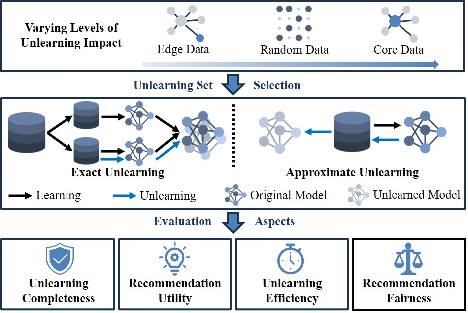

# CURE4Rec: A Benchmark for Recommendation Unlearning with Deeper Influence

[comment]: <> ([![License: MIT]&#40;https://img.shields.io/badge/License-MIT-yellow.svg&#41;]&#40;LICENSE&#41;)

[](https://github.com/xiye7lai/CURE4Rec)
[](https://github.com/xiye7lai/CURE4Rec)
[](https://github.com/xiye7lai/CURE4Rec)

<table align="center">
  <tr>
    <td align="center"> 
       
      <br>
      <em style="font-size: 18px;">  <strong style="font-size: 18px;">Figure 1:</strong> An illustration of CURE4Rec, a comprehensive benchmark tailored for evaluating recommendation unlearning methods. </em>
    </td>
  </tr>
</table>


## Evaluation

We provide a script 'run.sh' where you can configure the recommendation unlearning methods you want to evaluate, as well as the datasets, unlearning sets, recommendation models, hyper-parameters, and other settings.

```bash
./run.sh
```

If you want to perform fine-grained configuration when running the script, you can run 'main.py'. Below is an example:

```bash
python main.py --epoch 50 --dataset ml-100k --model wmf --group 10 --learn retrain --deltype random --delper 5 --verbose 2
```